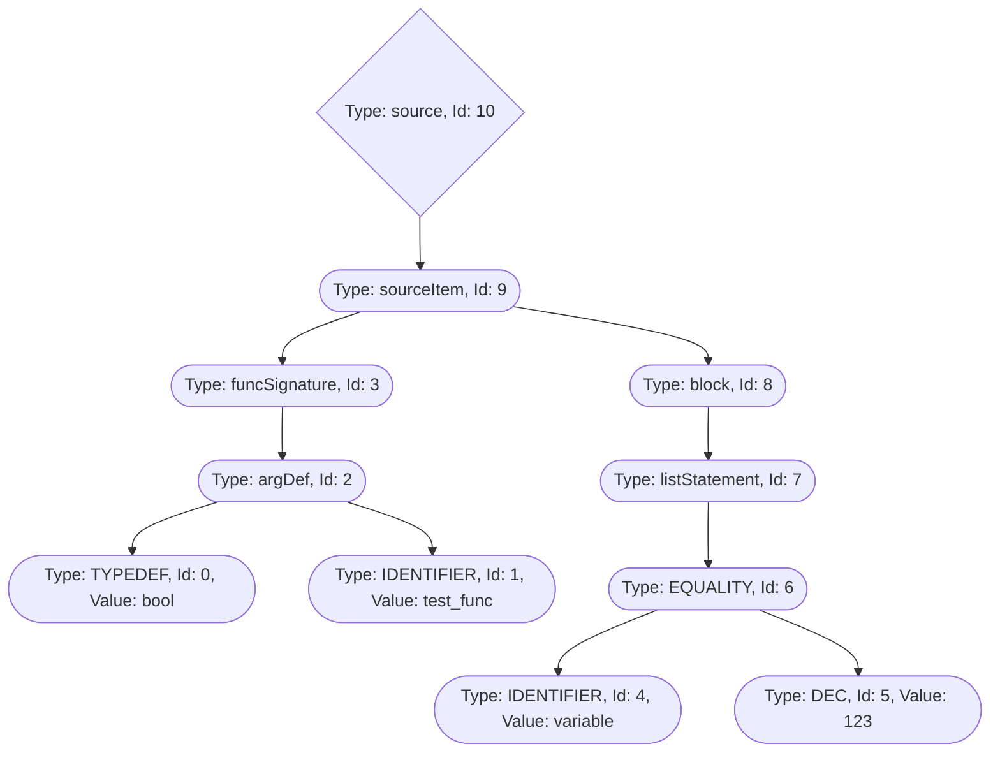

```mermaid
flowchart TB
node10([Type: source, Id: 10]) --> node9([Type: sourceItem, Id: 9])
node9([Type: sourceItem, Id: 9]) --> node3([Type: funcSignature, Id: 3])
node3([Type: funcSignature, Id: 3]) --> node2([Type: argDef, Id: 2])
node2([Type: argDef, Id: 2]) --> node0([Type: TYPEDEF, Id: 0, Value: bool])
node2([Type: argDef, Id: 2]) --> node1([Type: IDENTIFIER, Id: 1, Value: test_func])
node9([Type: sourceItem, Id: 9]) --> node8([Type: block, Id: 8])
node8([Type: block, Id: 8]) --> node7([Type: listStatement, Id: 7])
node7([Type: listStatement, Id: 7]) --> node6([Type: EQUALITY, Id: 6])
node6([Type: EQUALITY, Id: 6]) --> node4([Type: IDENTIFIER, Id: 4, Value: variable])
node6([Type: EQUALITY, Id: 6]) --> node5([Type: DEC, Id: 5, Value: 123])
node10{Type: source, Id: 10}
```
