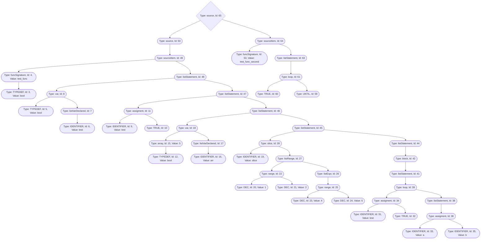

```mermaid
flowchart TB
node65([Type: source, Id: 65]) --> node50([Type: source, Id: 50])
node50([Type: source, Id: 50]) --> node49([Type: sourceItem, Id: 49])
node49([Type: sourceItem, Id: 49]) --> node4([Type: funcSignature, Id: 4, Value: test_func])
node4([Type: funcSignature, Id: 4, Value: test_func]) --> node3([Type: TYPEDEF, Id: 3, Value: bool])
node49([Type: sourceItem, Id: 49]) --> node48([Type: listStatement, Id: 48])
node48([Type: listStatement, Id: 48]) --> node8([Type: var, Id: 8])
node8([Type: var, Id: 8]) --> node5([Type: TYPEDEF, Id: 5, Value: bool])
node8([Type: var, Id: 8]) --> node7([Type: listVarDeclared, Id: 7])
node7([Type: listVarDeclared, Id: 7]) --> node6([Type: IDENTIFIER, Id: 6, Value: test])
node48([Type: listStatement, Id: 48]) --> node47([Type: listStatement, Id: 47])
node47([Type: listStatement, Id: 47]) --> node11([Type: assigment, Id: 11])
node11([Type: assigment, Id: 11]) --> node9([Type: IDENTIFIER, Id: 9, Value: test])
node11([Type: assigment, Id: 11]) --> node10([Type: TRUE, Id: 10])
node47([Type: listStatement, Id: 47]) --> node46([Type: listStatement, Id: 46])
node46([Type: listStatement, Id: 46]) --> node18([Type: var, Id: 18])
node18([Type: var, Id: 18]) --> node15([Type: array, Id: 15, Value: 5])
node15([Type: array, Id: 15, Value: 5]) --> node12([Type: TYPEDEF, Id: 12, Value: bool])
node18([Type: var, Id: 18]) --> node17([Type: listVarDeclared, Id: 17])
node17([Type: listVarDeclared, Id: 17]) --> node16([Type: IDENTIFIER, Id: 16, Value: arr])
node46([Type: listStatement, Id: 46]) --> node45([Type: listStatement, Id: 45])
node45([Type: listStatement, Id: 45]) --> node28([Type: slice, Id: 28])
node28([Type: slice, Id: 28]) --> node19([Type: IDENTIFIER, Id: 19, Value: slice])
node28([Type: slice, Id: 28]) --> node27([Type: listRange, Id: 27])
node27([Type: listRange, Id: 27]) --> node22([Type: range, Id: 22])
node22([Type: range, Id: 22]) --> node20([Type: DEC, Id: 20, Value: 1])
node22([Type: range, Id: 22]) --> node21([Type: DEC, Id: 21, Value: 2])
node27([Type: listRange, Id: 27]) --> node26([Type: listExpr, Id: 26])
node26([Type: listExpr, Id: 26]) --> node25([Type: range, Id: 25])
node25([Type: range, Id: 25]) --> node23([Type: DEC, Id: 23, Value: 4])
node25([Type: range, Id: 25]) --> node24([Type: DEC, Id: 24, Value: 6])
node45([Type: listStatement, Id: 45]) --> node44([Type: listStatement, Id: 44])
node44([Type: listStatement, Id: 44]) --> node42([Type: block, Id: 42])
node42([Type: block, Id: 42]) --> node41([Type: listStatement, Id: 41])
node41([Type: listStatement, Id: 41]) --> node39([Type: loop, Id: 39])
node39([Type: loop, Id: 39]) --> node34([Type: assigment, Id: 34])
node34([Type: assigment, Id: 34]) --> node31([Type: IDENTIFIER, Id: 31, Value: test])
node34([Type: assigment, Id: 34]) --> node32([Type: TRUE, Id: 32])
node39([Type: loop, Id: 39]) --> node38([Type: listStatement, Id: 38])
node38([Type: listStatement, Id: 38]) --> node36([Type: assigment, Id: 36])
node36([Type: assigment, Id: 36]) --> node33([Type: IDENTIFIER, Id: 33, Value: a])
node36([Type: assigment, Id: 36]) --> node35([Type: IDENTIFIER, Id: 35, Value: b])
node65([Type: source, Id: 65]) --> node64([Type: sourceItem, Id: 64])
node64([Type: sourceItem, Id: 64]) --> node53([Type: funcSignature, Id: 53, Value: test_func_second])
node64([Type: sourceItem, Id: 64]) --> node63([Type: listStatement, Id: 63])
node63([Type: listStatement, Id: 63]) --> node61([Type: loop, Id: 61])
node61([Type: loop, Id: 61]) --> node60([Type: TRUE, Id: 60])
node61([Type: loop, Id: 61]) --> node59([Type: UNTIL, Id: 59])
node65{Type: source, Id: 65}
```
