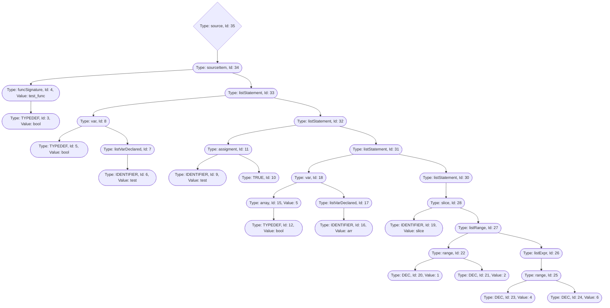

```mermaid
flowchart TB
node35([Type: source, Id: 35]) --> node34([Type: sourceItem, Id: 34])
node34([Type: sourceItem, Id: 34]) --> node4([Type: funcSignature, Id: 4, Value: test_func])
node4([Type: funcSignature, Id: 4, Value: test_func]) --> node3([Type: TYPEDEF, Id: 3, Value: bool])
node34([Type: sourceItem, Id: 34]) --> node33([Type: listStatement, Id: 33])
node33([Type: listStatement, Id: 33]) --> node8([Type: var, Id: 8])
node8([Type: var, Id: 8]) --> node5([Type: TYPEDEF, Id: 5, Value: bool])
node8([Type: var, Id: 8]) --> node7([Type: listVarDeclared, Id: 7])
node7([Type: listVarDeclared, Id: 7]) --> node6([Type: IDENTIFIER, Id: 6, Value: test])
node33([Type: listStatement, Id: 33]) --> node32([Type: listStatement, Id: 32])
node32([Type: listStatement, Id: 32]) --> node11([Type: assigment, Id: 11])
node11([Type: assigment, Id: 11]) --> node9([Type: IDENTIFIER, Id: 9, Value: test])
node11([Type: assigment, Id: 11]) --> node10([Type: TRUE, Id: 10])
node32([Type: listStatement, Id: 32]) --> node31([Type: listStatement, Id: 31])
node31([Type: listStatement, Id: 31]) --> node18([Type: var, Id: 18])
node18([Type: var, Id: 18]) --> node15([Type: array, Id: 15, Value: 5])
node15([Type: array, Id: 15, Value: 5]) --> node12([Type: TYPEDEF, Id: 12, Value: bool])
node18([Type: var, Id: 18]) --> node17([Type: listVarDeclared, Id: 17])
node17([Type: listVarDeclared, Id: 17]) --> node16([Type: IDENTIFIER, Id: 16, Value: arr])
node31([Type: listStatement, Id: 31]) --> node30([Type: listStatement, Id: 30])
node30([Type: listStatement, Id: 30]) --> node28([Type: slice, Id: 28])
node28([Type: slice, Id: 28]) --> node19([Type: IDENTIFIER, Id: 19, Value: slice])
node28([Type: slice, Id: 28]) --> node27([Type: listRange, Id: 27])
node27([Type: listRange, Id: 27]) --> node22([Type: range, Id: 22])
node22([Type: range, Id: 22]) --> node20([Type: DEC, Id: 20, Value: 1])
node22([Type: range, Id: 22]) --> node21([Type: DEC, Id: 21, Value: 2])
node27([Type: listRange, Id: 27]) --> node26([Type: listExpr, Id: 26])
node26([Type: listExpr, Id: 26]) --> node25([Type: range, Id: 25])
node25([Type: range, Id: 25]) --> node23([Type: DEC, Id: 23, Value: 4])
node25([Type: range, Id: 25]) --> node24([Type: DEC, Id: 24, Value: 6])
node35{Type: source, Id: 35}
```
